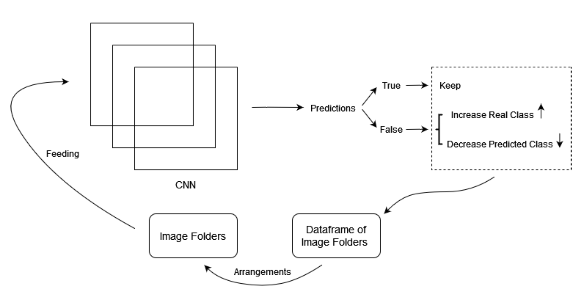
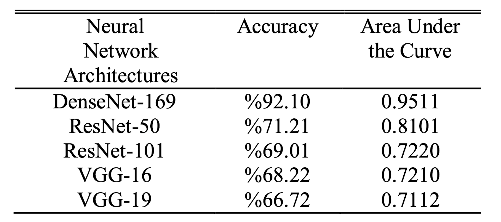
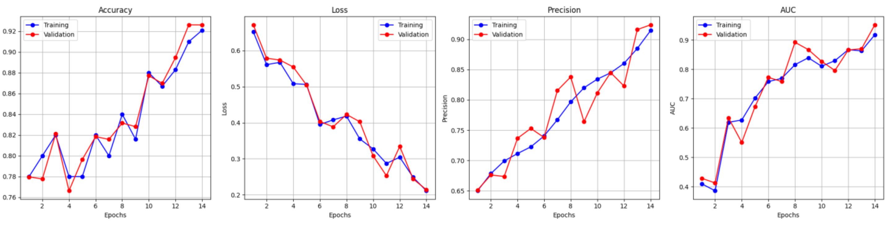
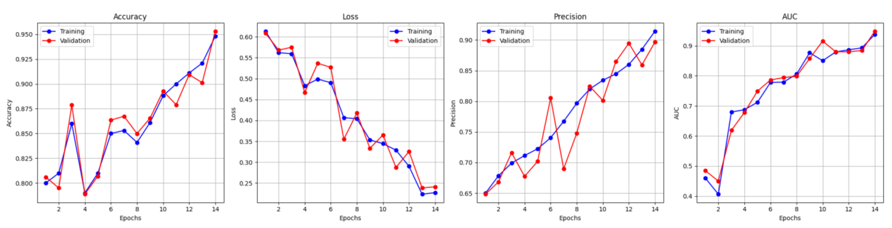

# Solving Imbalanced Classes in Machine Learning - Final Thesis

## Overview
This final thesis project, conducted by Emirhan Bilgiç and Emre Akcin under the supervision of Assc. Prof. Dr. İsa Yıldırım addresses the challenge of imbalanced classes in machine learning datasets. Our primary case study utilizes an Alzheimer's dataset from Kaggle.

[Alzheimer's Dataset - 4 Class of Images](https://www.kaggle.com/datasets/tourist55/alzheimers-dataset-4-class-of-images)

## Project Structure
The project is structured into three main phases:

### 1. Hyperparameter Optimization
Utilizing Hyperopt for optimal parameter selection to enhance model performance.

### 2. Data Adjustment
Implementing techniques to adjust the dataset to better handle class imbalances, is the central focus of this thesis.

### 3. Ensemble Learning
Applying ensemble learning methods to improve prediction accuracy by combining multiple models.

## Figures and Results

### Figure 1: Designed Structure in the Project

**Explanation:** This diagram illustrates the workflow of the CNN model used in the project. Data from image folders are fed into the CNN, which then predicts classifications. Based on the prediction accuracy, adjustments are made either to increase the real class count or decrease the expected class count.

### Figure 2: Benchmark of the Methods

**Explanation:** This table displays the accuracy and AUC (Area Under the Curve) for different neural network architectures tested, including DenseNet-169, ResNet-50, ResNet-101, VGG-16, and VGG-19. DenseNet-169 outperformed other models in both metrics.

### Figure 3: Performance Metrics Before Data Adjustment

**Explanation:** These graphs show the training and validation accuracy, loss, precision, and AUC across epochs before applying data adjustment techniques. Noticeable fluctuations indicate the model's instability due to class imbalance.

### Figure 4: Performance Metrics After Data Adjustment

**Explanation:** Post data adjustment, these graphs illustrate improvements in model stability and performance metrics, including accuracy, loss, precision, and AUC, over the same number of epochs.

## Objective
The goal of this thesis is to develop and evaluate strategies that mitigate the impact of imbalanced classes, thereby improving the efficacy of machine learning models in practical applications.
